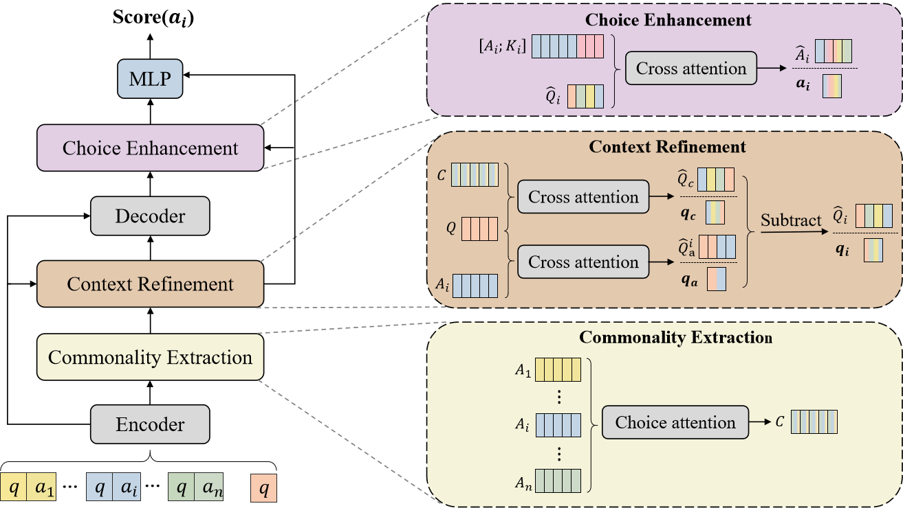

# DCQA
Hi all, this is the official repository for ECAI 2024 paper: Differentiating Choices via Commonality for Multiple-Choice Question Answering. Our paper can be found at [arXiv link]. We sincerely apprecaite your interests in our projects!

# Architecture
Brifely, we propose a novel MCQA model by differentiating choices through identifying and eliminating their commonality, called DCQA. 

# Dependencies

# Data

# Run

# Reference
